# Setup certificates, provisioning profiles to develop iOS on multiple machines/computers

## 1. Create .certSigningRequest

### 1.1 Open Keychain Access

### 1.2 Select Keychain Access > Certificate Assistant > Request a Certificate From a Certificate Authority…
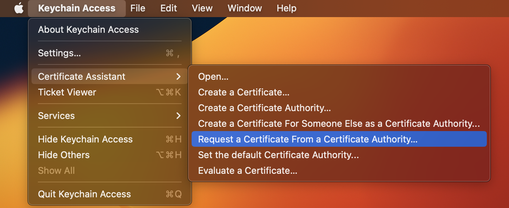

### 1.3 Enter email, name & click Continue
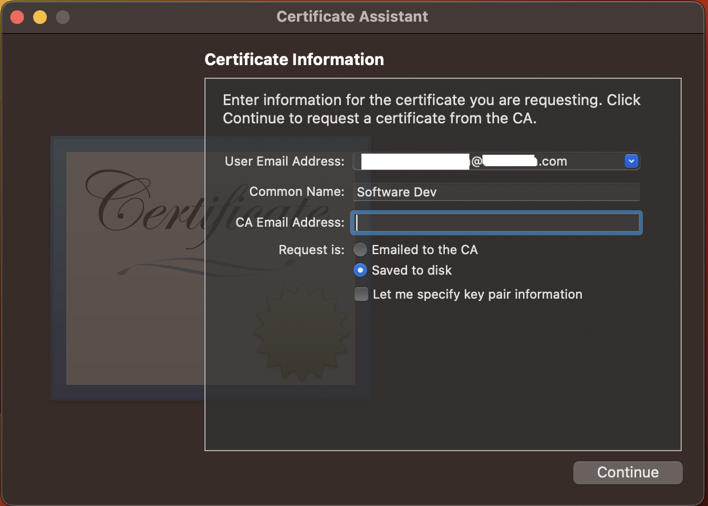

### 1.4 Save file .certSigningRequest
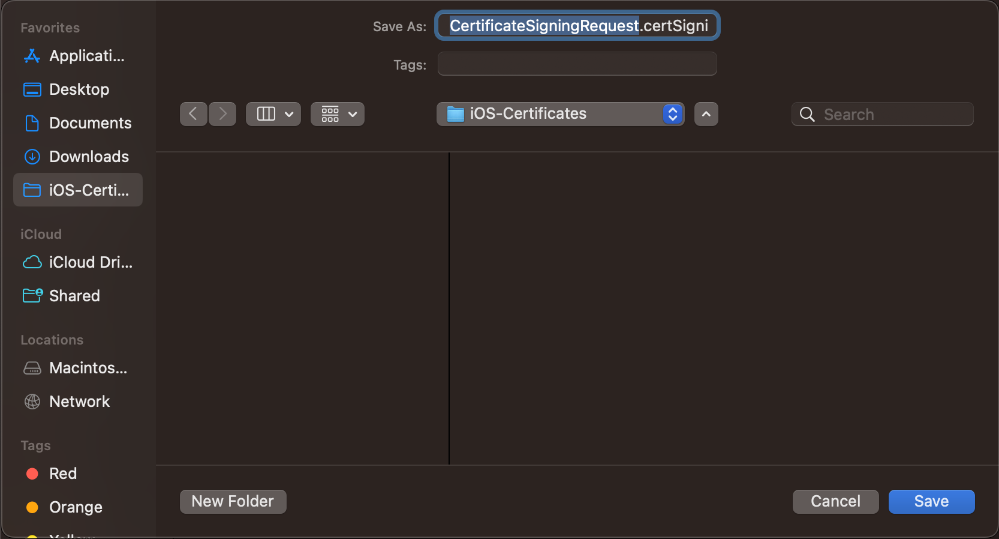

## 2. Create Apple Development/Distribution certificate

### 2.1 Go to https://developer.apple.com/account/resources/certificates/list

### 2.2 Add certificate by click to button add (+)
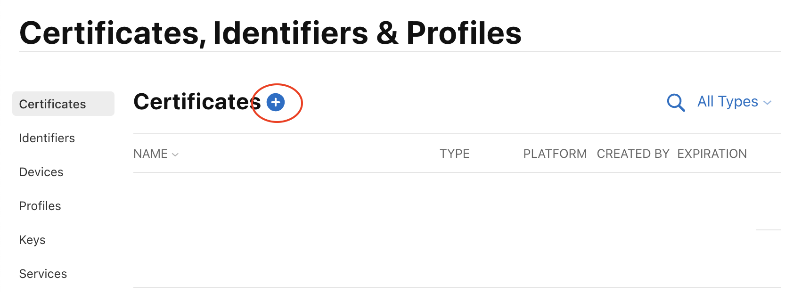

### 2.3 Choose Apple Development/Apple Distribution & click Continue
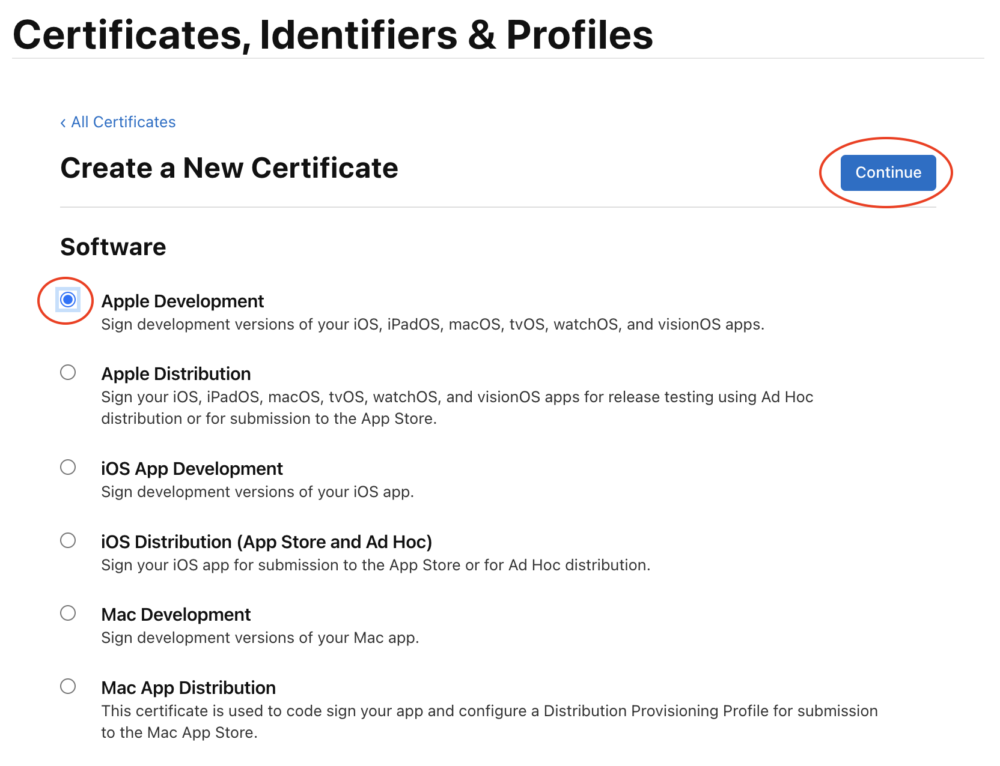

### 2.4 Choose file .certSigningRequest (in Step 1.4)
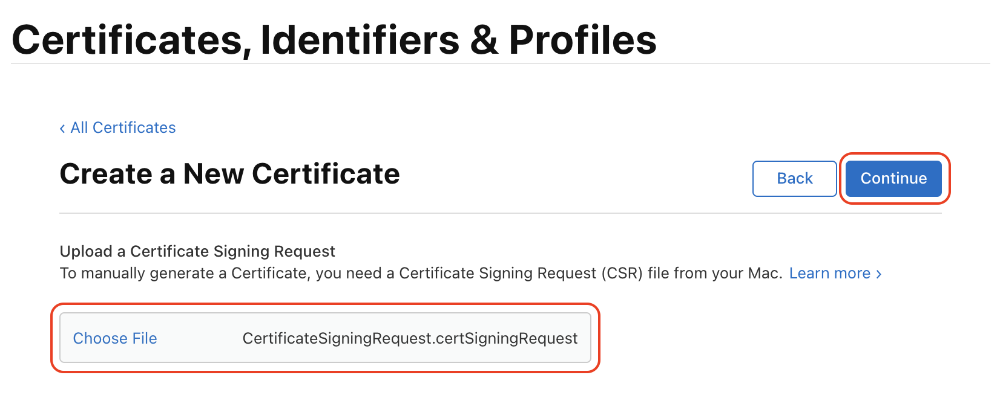

### 2.5 Download Development/Distribution certificate (file .cer)
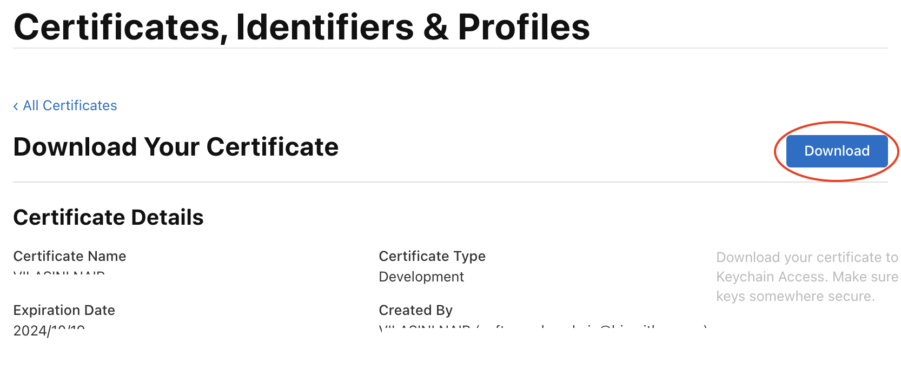

### 2.6 Double click to certificate to add to your keychain
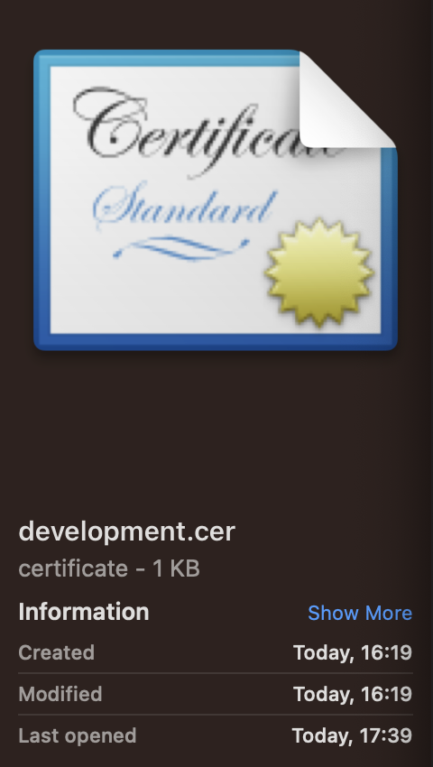

## 3. Create development/distribution provisioning profile

### 3.1 Open https://developer.apple.com/account/resources/profiles/list

### 3.2 Add profile by click button add (+)
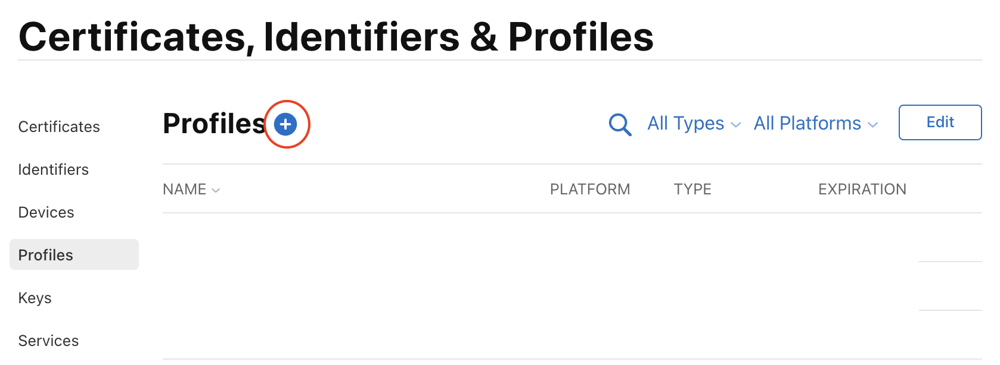

### 3.3 Choose iOS App Development (or App Store) & click Continue
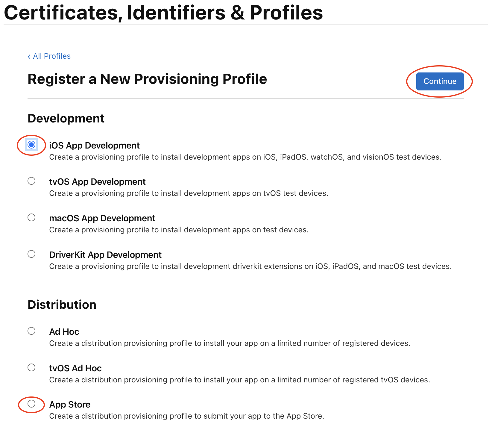

### 3.4 Select your app ID from dropdown & click Continue
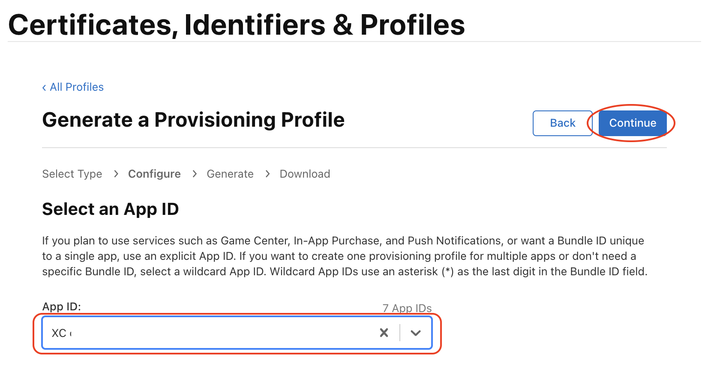

### 3.5 Select certificates & click Continue
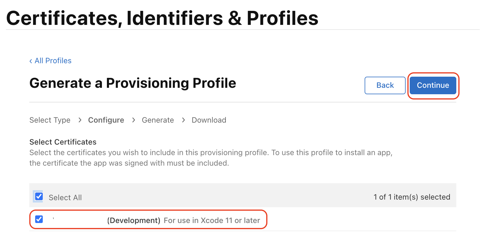

### 3.6 Select devices & click Continue (optional)
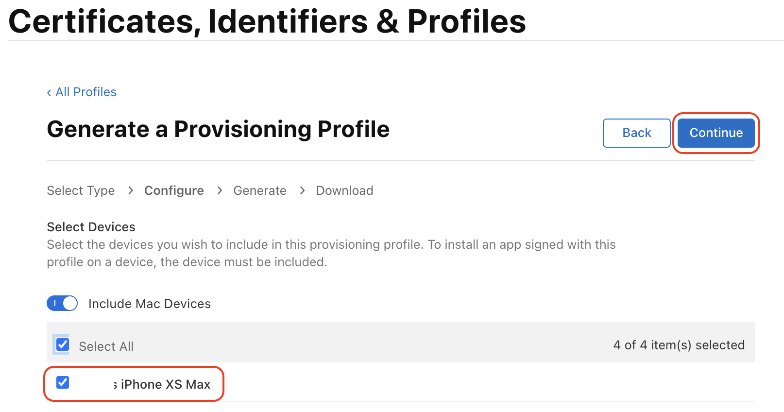

### 3.7 Enter provisioning profile name & click Generate
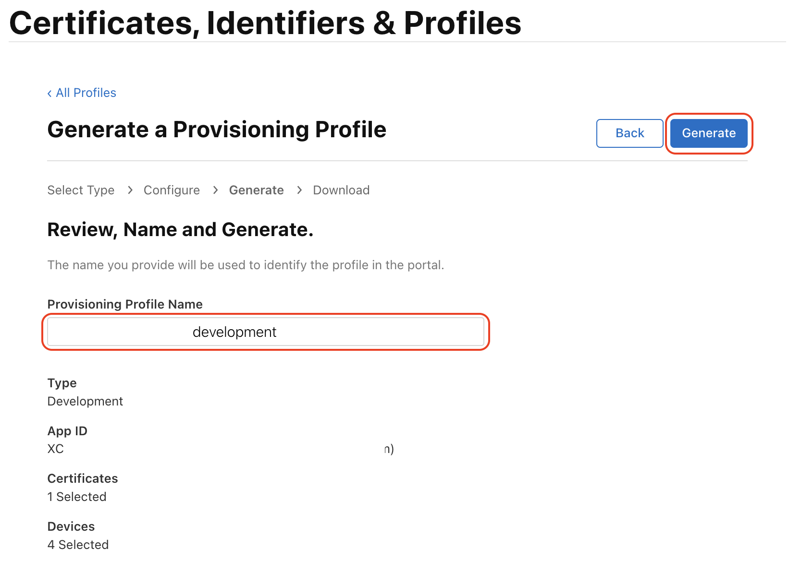

### 3.8 Download provisioning profile (file .mobileprovision)
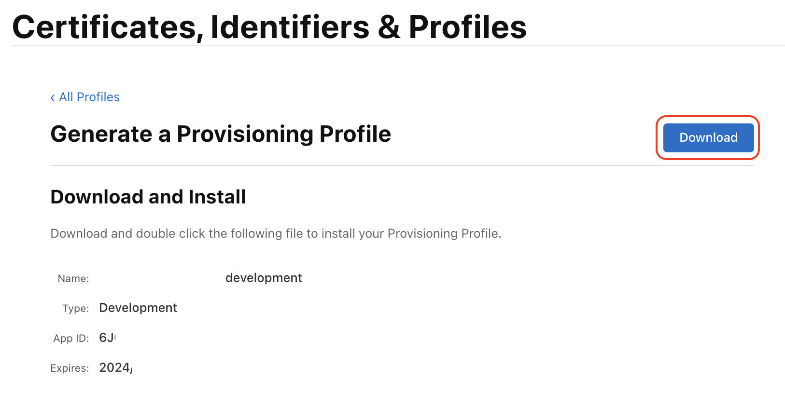

### 3.9 Open project by XCode

### 3.10 Import Development/Distribution .mobileprovision to your project
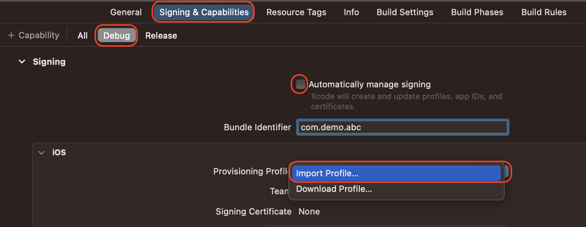

#### Note
- It may not work on the first time, quit Xcode & reopen project

#### Congratulation:
- You're done. From now, you can build & distribute iOS app on your own machine
- To develop on another machines, you need to do one more step

## 4. Export your certificates to develop on multiple machines

### 4.1 Open Keychain Access && enter “apple” in search box

### 4.2 Search installed certificates
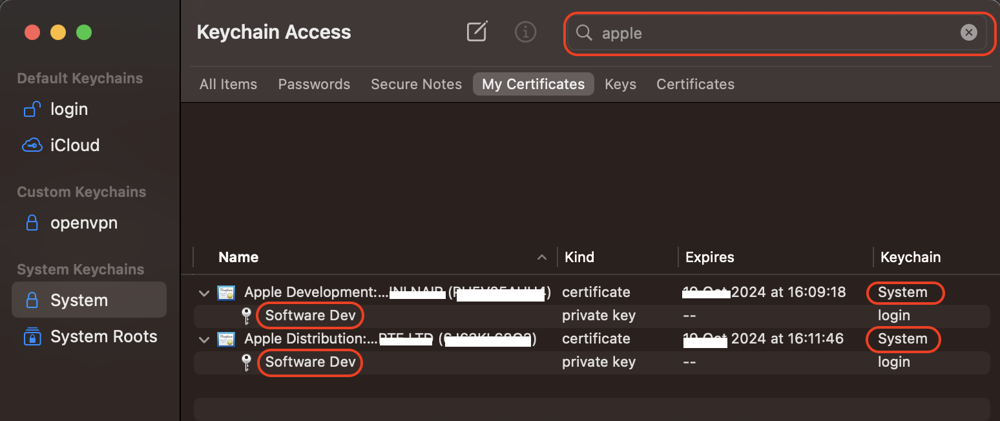

#### Note
- Certificate must contain private key && Name of private key must be the same with name in Step 1.3

### 4.3 Export Development/Distribution certificates
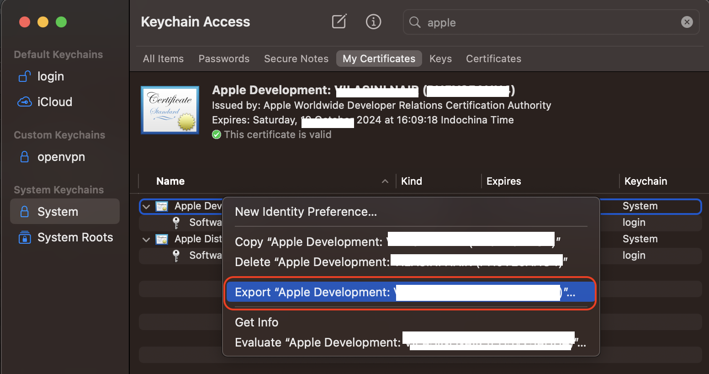

### 4.4 Choose format: Personal Information Exchange .p12 & save
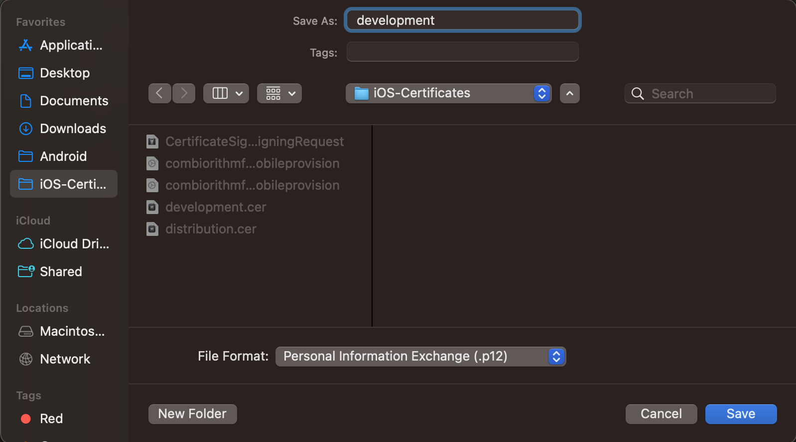

#### Note
- Other file formats will not work as expected

### 4.5 Done: Send files (.p12 & .mobileprovision) to another computer & work
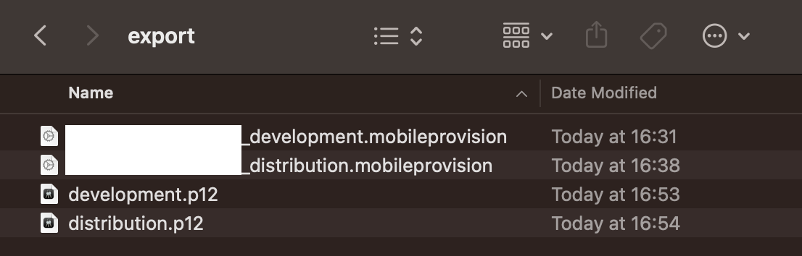

#### Congratulation: Everything done 🎉🎉🎉
